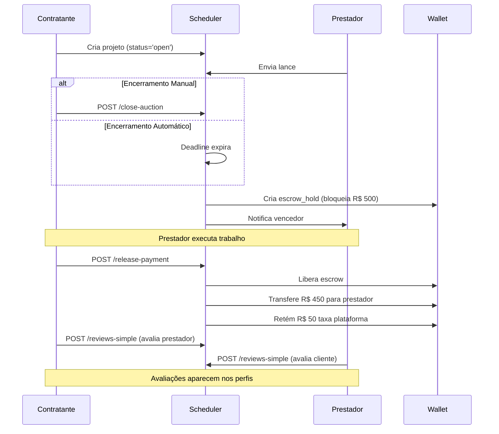

# 🚀 Novos Endpoints - Sistema de Escrow e Avaliações

## 📋 Índice
- [Encerramento de Leilão](#encerramento-de-leilão)
- [Liberação de Pagamento](#liberação-de-pagamento)
- [Sistema de Avaliações](#sistema-de-avaliações)

---

## 🏁 Encerramento de Leilão

### POST `/api/projects/:id/close-auction`

Permite ao contratante encerrar manualmente o leilão antes do prazo.

**Autenticação:** Obrigatória (JWT)

**Parâmetros:**
- `id` (path) - ID do projeto

**Validações:**
- Usuário deve ser o contratante (contractor_id)
- Projeto deve estar com status `open`
- Deve haver pelo menos 1 lance pendente

**Resposta de Sucesso (200):**
```json
{
  "success": true,
  "message": "Leilão encerrado com sucesso"
}
```

**Erros:**
- `404` - Projeto não encontrado
- `403` - Você não tem permissão para encerrar este leilão
- `400` - Este projeto não está mais em leilão

**Fluxo Automático:**
1. Seleciona o lance de menor valor
2. Atualiza projeto: status='awarded', winner_id, final_price
3. Cria escrow_hold bloqueando saldo do contratante
4. Envia notificações para vencedor e perdedores

**Exemplo:**
```javascript
const response = await api.post(`/projects/${projectId}/close-auction`)
```

---

## 💰 Liberação de Pagamento

### POST `/api/projects/:id/release-payment`

Libera o pagamento do escrow para o prestador após conclusão do trabalho.

**Autenticação:** Obrigatória (JWT)

**Parâmetros:**
- `id` (path) - ID do projeto

**Validações:**
- Usuário deve ser o contratante
- Projeto deve ter status `awarded`
- payment_status deve estar como `escrow_hold` ou `pending`
- Deve haver um vencedor definido (winner_id)

**Resposta de Sucesso (200):**
```json
{
  "success": true,
  "message": "Pagamento liberado com sucesso"
}
```

**Transações Criadas:**

1. **Escrow Release** (Cliente):
```json
{
  "type": "escrow_release",
  "amount": 0,
  "status": "completed",
  "description": "Pagamento liberado - Projeto: Título"
}
```

2. **Payment Received** (Prestador):
```json
{
  "type": "payment_received",
  "amount": 450.00,
  "status": "completed",
  "description": "Pagamento recebido - Projeto: Título (Taxa: 10%)"
}
```

3. **Platform Fee** (Cliente):
```json
{
  "type": "platform_fee",
  "amount": -50.00,
  "status": "completed",
  "description": "Taxa da plataforma (10%) - Projeto: Título"
}
```

**Cálculo da Taxa:**
```javascript
const finalPrice = 500.00
const platformFeePercent = 10 // Configurável via PLATFORM_FEE_PERCENT
const platformFee = finalPrice * 0.10 // 50.00
const providerAmount = finalPrice - platformFee // 450.00
```

**Exemplo:**
```javascript
const response = await api.post(`/projects/${projectId}/release-payment`)
// Cliente paga R$ 500 (retidos em escrow)
// Prestador recebe R$ 450
// Plataforma retém R$ 50
```

**Erros:**
- `404` - Projeto não encontrado ou você não é o contratante
- `400` - Pagamento já foi liberado anteriormente
- `400` - Projeto não tem vencedor definido

---

## ⭐ Sistema de Avaliações

### POST `/api/reviews-simple`

Cria uma avaliação após a conclusão do projeto.

**Autenticação:** Obrigatória (JWT)

**Body:**
```json
{
  "project_id": 123,
  "reviewed_id": 456,
  "rating": 5,
  "comment": "Excelente trabalho! Entregou no prazo e com qualidade.",
  "is_public": true
}
```

**Campos:**
- `project_id` (obrigatório) - ID do projeto
- `reviewed_id` (opcional) - ID do usuário avaliado (auto-detecta se omitido)
- `rating` (obrigatório) - Nota de 1 a 5
- `comment` (opcional) - Comentário textual
- `is_public` (opcional) - Default: true

**Validações:**
- Rating deve estar entre 1 e 5
- payment_status do projeto deve ser `released`
- Usuário deve ser contratante ou prestador do projeto
- Não pode avaliar o mesmo projeto duas vezes

**Resposta de Sucesso (201):**
```json
{
  "success": true,
  "message": "Avaliação criada com sucesso",
  "data": {
    "id": 789,
    "project_id": 123,
    "reviewer_id": 1,
    "reviewed_id": 456,
    "rating": 5,
    "comment": "Excelente trabalho!"
  }
}
```

**Erros:**
- `400` - Rating deve ser entre 1 e 5
- `404` - Projeto não encontrado ou pagamento ainda não foi liberado
- `409` - Você já avaliou este projeto

**Notificação Automática:**
O usuário avaliado recebe notificação com:
- Tipo: `review`
- Título: "⭐ Nova Avaliação Recebida!"
- Conteúdo: "Você recebeu uma avaliação de X estrelas no projeto..."

---

### GET `/api/reviews-simple/user/:userId`

Retorna o rating médio e lista de avaliações de um usuário.

**Autenticação:** Não obrigatória

**Parâmetros:**
- `userId` (path) - ID do usuário
- `limit` (query) - Default: 10
- `offset` (query) - Default: 0

**Resposta (200):**
```json
{
  "success": true,
  "data": {
    "avgRating": 4.5,
    "totalReviews": 12,
    "reviews": [
      {
        "id": 789,
        "project_id": 123,
        "rating": 5,
        "comment": "Excelente!",
        "created_at": "2025-12-30T10:00:00Z",
        "reviewer_id": 1,
        "reviewer_name": "João Silva",
        "reviewer_avatar": "https://...",
        "project_title": "Desenvolvimento de Website"
      }
    ]
  },
  "pagination": {
    "limit": 10,
    "offset": 0,
    "total": 12
  }
}
```

**Exemplo:**
```javascript
const response = await api.get(`/reviews-simple/user/${userId}?limit=5`)
console.log(`Rating médio: ${response.data.data.avgRating} ⭐`)
```

---

### GET `/api/reviews-simple/project/:projectId`

Retorna todas as avaliações de um projeto (ambas as partes).

**Autenticação:** Não obrigatória

**Parâmetros:**
- `projectId` (path) - ID do projeto

**Resposta (200):**
```json
{
  "success": true,
  "data": [
    {
      "id": 789,
      "reviewer_id": 1,
      "reviewed_id": 456,
      "rating": 5,
      "comment": "Prestador excelente!",
      "is_public": true,
      "created_at": "2025-12-30T10:00:00Z",
      "reviewer_name": "João Silva",
      "reviewer_avatar": "https://...",
      "reviewed_name": "Maria Santos",
      "reviewed_avatar": "https://..."
    },
    {
      "id": 790,
      "reviewer_id": 456,
      "reviewed_id": 1,
      "rating": 5,
      "comment": "Cliente muito profissional!",
      "is_public": true,
      "created_at": "2025-12-30T11:00:00Z",
      "reviewer_name": "Maria Santos",
      "reviewer_avatar": "https://...",
      "reviewed_name": "João Silva",
      "reviewed_avatar": "https://..."
    }
  ],
  "total": 2
}
```

**Exemplo:**
```javascript
const response = await api.get(`/reviews-simple/project/${projectId}`)
const reviews = response.data.data
console.log(`${reviews.length} avaliações mútuas`)
```

---

## 🔄 Fluxo Completo



---

## 🛠️ Variáveis de Ambiente

```env
# Taxa da plataforma (percentual)
PLATFORM_FEE_PERCENT=10

# Intervalo de verificação do scheduler (ms)
AUCTION_CHECK_INTERVAL=60000
```

---

## ✅ Checklist de Integração Frontend

- [x] Importar `ReleasePaymentButton.vue` em ProjectDetail
- [x] Adicionar handler `handlePaymentReleased`
- [ ] Criar ReviewSection.vue para perfis
- [ ] Adicionar ReviewForm após pagamento liberado
- [ ] Mostrar ReviewList no perfil do usuário

---

## 📊 Estrutura do Banco

**Campos adicionais em `projects`:**
- `winner_id` INT - ID do prestador vencedor
- `winner_bid_id` INT - ID do lance vencedor
- `final_price` DECIMAL - Valor final do contrato
- `payment_status` ENUM('pending','escrow_hold','released')

**Tabela `reviews`:**
```sql
CREATE TABLE reviews (
  id INT AUTO_INCREMENT PRIMARY KEY,
  project_id INT NOT NULL,
  reviewer_id INT NOT NULL,
  reviewed_id INT NOT NULL,
  rating INT NOT NULL CHECK (rating >= 1 AND rating <= 5),
  comment TEXT,
  is_public TINYINT(1) DEFAULT 1,
  created_at DATETIME DEFAULT NOW(),
  updated_at DATETIME DEFAULT NOW() ON UPDATE NOW(),
  UNIQUE KEY unique_review (project_id, reviewer_id)
);
```

**Tipos de `wallet_transactions`:**
- `escrow_hold` - Valor bloqueado em escrow
- `escrow_release` - Liberação de escrow (amount=0, apenas marca)
- `payment_received` - Pagamento recebido pelo prestador
- `platform_fee` - Taxa retida pela plataforma

---

## 🎯 Próximos Passos

1. ✅ Backend totalmente funcional
2. ✅ ReleasePaymentButton integrado
3. ⏳ Teste manual end-to-end
4. ⏳ ReviewSection no perfil
5. ⏳ Deploy em produção
